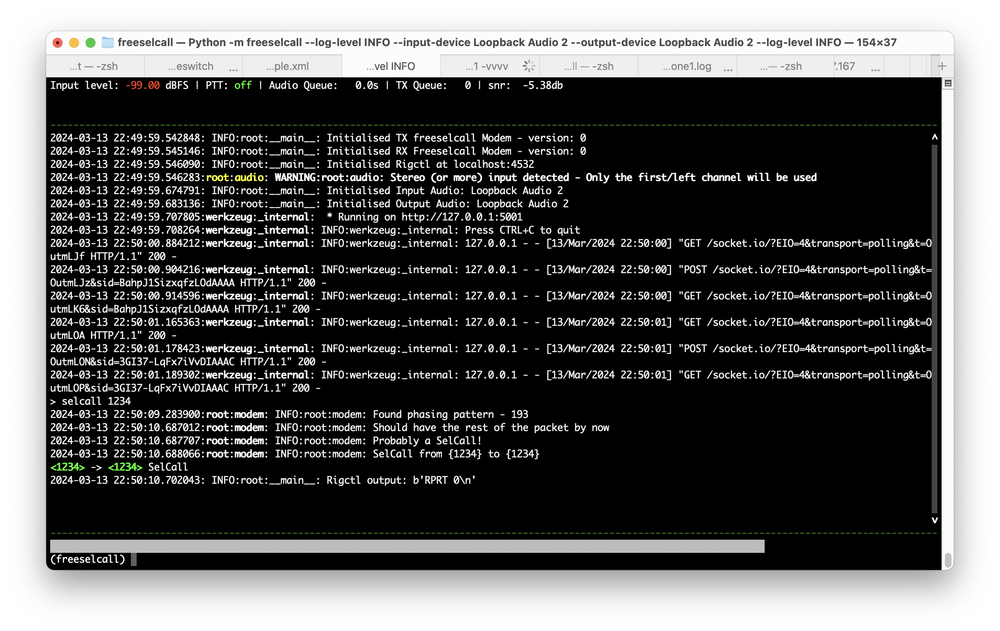
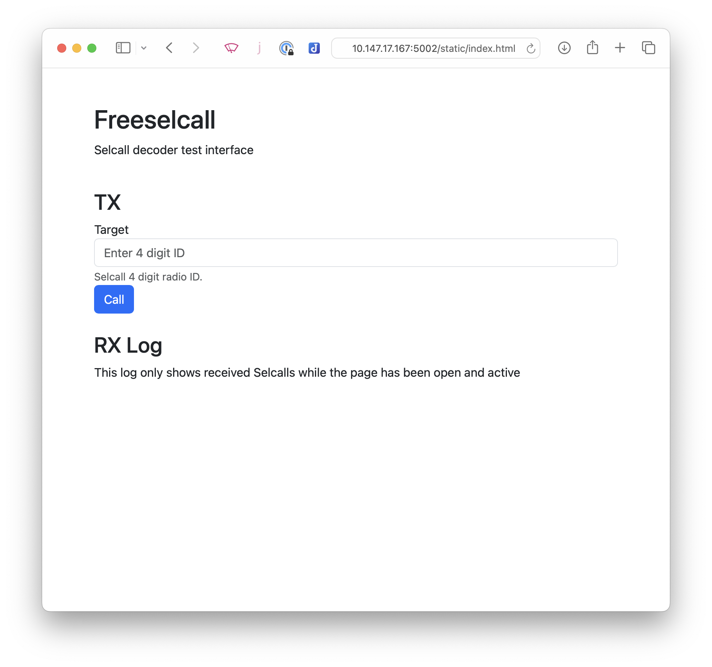

Freeselcall
==
[](https://scratchanitch.dev)

Codan 4 digit Selcall encoder and decoder

> [!IMPORTANT]  
> This project is to scratch an itch. It works on a very limited set of Codan HF Selcall. It likely won't work with other vendors or even other types of Codan Selcall. If you want to have support for these, you'll have to work it out - though I will accept well crafted pull requests.
> 
> Code in this repo is hacky and barely functional. There are likely performance issues and many edge cases. Feel free to log issues for these, however I won't be able to address all of them. Nor will I be timely.
>
> I made this because I couldn't find anything else that did this. I did not want to make this.
> 
> This is not a place of honor

## Features
 - Codan HF Selcall (4 digits)
 - Codan Page calls - sending and receiving - with magic bytes
 - Basic web interface
 - CLI interface
 - Websockets for application integration



## Unsupported
 - Windows

## Requirements
 - hamlib
 - portaudio / pyaudio
 - c build tools / cmake

## Running with Docker

Example:
```
docker run -p 5001:5001 --name freeselcall --rm --device /dev/snd -it ghcr.io/xssfox/freeselcall:latest --help
```

## Install with pip
```
# install required system packages
sudo apt-get update
sudo apt install git build-essential cmake portaudio19-dev python3 python3-dev libhamlib-utils

sudo apt install pipx
pipx ensurepath

# make sure the PATH is set correctly
source ~/.profile

pipx install freeselcall

freeselcall --help
```


## Install from source

Instructions for a raspberrypi. Requires bookworm or python 3.11 to be installed. UNTESTED

```sh
# install required system packages
sudo apt-get update
sudo apt install git build-essential cmake portaudio19-dev python3 python3-dev libhamlib-utils

sudo apt install pipx
pipx ensurepath

# make sure the PATH is set correctly
source ~/.profile

pipx install poetry


# install freeselcall
git clone --recurse-submodules https://github.com/xssfox/freeselcall.git
cd freeselcall

# the headers installed by libcodec2 make install don't include kiss_fftr.h required by the modem
poetry install
poetry shell
python3 -m freeselcall
```


## Running
```
# Run rigctld in background. See rigctld --help on how to configure your rig
rigctld -m 1 -r /dev/null &

# Test to make sure rigctl works
rigctl -m 2 T 1 # enable PTT
rigctl -m 2 T 0 # disable PTT

# Get argument help
freeselcall --help

#list audio devices
freeselcall --list-audio-devices

freeselcall --output-device 0 --input-device 0 --log-level DEBUG # it's useful to have debug turned on when first testing
```

## Testing

The CLI has a handy `test_ptt` to make test that PTT and sound output is working.

## Web
By default the web interface runs on port 5002. It can be accessed at http://localhost:5002/



Socket.io is used to. Subscribe to:
 - selcall
 - preamble
 - info

Emit:
 - info
 - selcall, id

## Command line arguments
```
freeselcall --help
\usage: freeselcall [-h] [-c C] [--no-cli] [--list-audio-devices] [--log-level {CRITICAL,FATAL,ERROR,WARN,WARNING,INFO,DEBUG,NOTSET}] [--input-device INPUT_DEVICE] [--output-device OUTPUT_DEVICE]
                   [--output-volume OUTPUT_VOLUME] [--rigctld-port RIGCTLD_PORT] [--rigctld-selcall-commands RIGCTLD_SELCALL_COMMANDS] [--rigctld-pretx RIGCTLD_PRETX] [--rigctld-posttx RIGCTLD_POSTTX]
                   [--rigctld-host RIGCTLD_HOST] [--ptt-on-delay-ms PTT_ON_DELAY_MS] [--ptt-off-delay-ms PTT_OFF_DELAY_MS] [--id ID] [--no-web] [--web-host WEB_HOST] [--web-port WEB_PORT]

options:
  -h, --help            show this help message and exit
  -c C, -config C       config file path
  --no-cli              [env var: FREESELCALL_NO_CLI]
  --list-audio-devices
  --log-level {CRITICAL,FATAL,ERROR,WARN,WARNING,INFO,DEBUG,NOTSET}
                        [env var: FREESELCALL_LOG_LEVEL]
  --input-device INPUT_DEVICE
                        [env var: FREESELCALL_INPUT_DEVICE]
  --output-device OUTPUT_DEVICE
                        [env var: FREESELCALL_OUTPUT_DEVICE]
  --output-volume OUTPUT_VOLUME
                        in db. postive = louder, negative = quiter [env var: FREESELCALL_OUTPUT_DB]
  --rigctld-port RIGCTLD_PORT
                        TCP port for rigctld - set to 0 to disable rigctld support [env var: FREESELCALL_RIGTCTLD_PORT]
  --rigctld-selcall-commands RIGCTLD_SELCALL_COMMANDS
                        Commands to send the rigctl server - for example 'L SQL 0' on ICOM will disable squelch when selcall is received [env var: FREESELCALL_RIGTCTLD_COMMAND]
  --rigctld-pretx RIGCTLD_PRETX
                        Commands to send the rigctl server before TXing (PTT already included) [env var: FREESELCALL_RIGTCTLD_PRETX_COMMAND]
  --rigctld-posttx RIGCTLD_POSTTX
                        Commands to send the rigctl server after TXing [env var: FREESELCALL_RIGTCTLD_POSTTX_COMMAND]
  --rigctld-host RIGCTLD_HOST
                        Host for rigctld [env var: FREESELCALL_RIGTCTLD_HOST]
  --ptt-on-delay-ms PTT_ON_DELAY_MS
                        Delay after triggering PTT before sending data [env var: FREESELCALL_PTT_ON_DELAY_MS]
  --ptt-off-delay-ms PTT_OFF_DELAY_MS
                        Delay after sending data before releasing PTT [env var: FREESELCALL_PTT_OFF_DELAY_MS]
  --id ID               ID to notify of selcall and used to send selcall [env var: FREESELCALL_ID]
  --no-web              [env var: FREESELCALL_NO_WEB]
  --web-host WEB_HOST   [env var: FREESELCALL_WEB_HOST]
  --web-port WEB_PORT   [env var: FREESELCALL_WEB_PORT]

Args that start with '--' can also be set in a config file (~/.freeselcall.conf or specified via -c). Config file syntax allows: key=value, flag=true, stuff=[a,b,c] (for details, see syntax at https://goo.gl/R74nmi). In
general, command-line values override environment variables which override config file values which override defaults.
```

## CLI commands
```
Freeselcall Help 
--------------- 
clear 
   Clears TX queues 
debug 
   Open the debug shell 
exception 
   Raises and exemption to test the shell 
exit 
   Exits freeselcall 
help 
   This help 
id 
   Sets ID - example: callsign N0CALL 
list_audio_devices 
   Lists audio device parameters 
log_level 
   Set the log level 
save_config 
   Save a config file to ~/.freeselcall.conf. Warning this will override your current config 
selcall 
   Performs a selcall - example: selcall 1234 
test_ptt 
   Turns on PTT for 2 seconds 
volume 
   Set the volume gain in db for output level - you probably want to use soundcard configuration or radio configuration rather than this.
```

Credits
--
David Rowe and the FreeDV team for developing the modem and libraries 